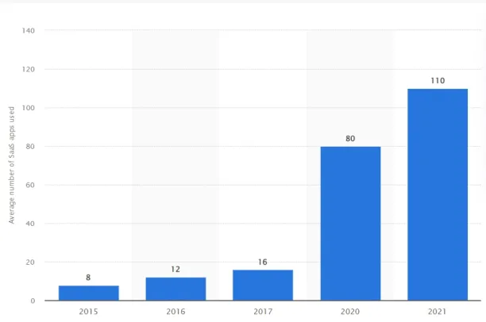

The Rise of Remote Work and the Need for Evolving Cybersecurity
===============================================================

The COVID-19 pandemic has dramatically altered how we work. With 87% of businesses adopting hybrid models, the traditional office is no longer the norm. Cloud platforms have taken the place of on-premises technologies, enabling flexible work locations. This shift, however, presents new cybersecurity challenges.

Previously, threats were primarily confined to physical devices and software within company walls. Today, securing a scattered workforce demands new approaches. This article explores how Donjun Digital can help companies minimize cyber risks in this "new normal" of remote and hybrid work.

Figure 1: Average number of Saas tools used per organization.

SASE, or Secure Access Service Edge, simplifies secure access for various scenarios, including branch offices, remote workers, and on-site users. This cloud-based service combines networking and security functions like SD-WAN, SWG, CASB, NGFW, and ZTNA. It prioritizes zero-trust access, meaning access is granted only after verifying the user's device identity, real-time context, and adherence to security and compliance policies.

Donjun's Secure Access Service Edge Provides the following:
 * Device Management gives you advantage what is considered as a corporate network device which elimnates the fact of intruders connected to your network.
 * Secure Web Gateway that provides more control over SaaS access and Internet Access.
 * Software Defined WAN rather than one way to reach the destination Donjun's SD-WAN allows aritifical intelligence to choose the optimal route to reach the destination.
 * Software Defined Perimeter which follows Zero Trust Network Architechture that Authenticate First before connected to the network rather than connect and then authenticate.
 * Unified Threat Management Stack that provides more visibility and context, Reduces complexiity on investigation, Interoperable, automated and orchestrated of systems, ability to collect, process and contextualize threat intelligence data, well connected to cloud.
 * Security Operation and Automation Response system automates is single platform for end to end incident and security lifecycle management.
 * Secure overlay quantum safe dynamic VPN's across the globe with high availibity, integrity and confidentiality.

.. note::

   This project is under active development.

Contents
--------

.. toctree::

   usage
   api
