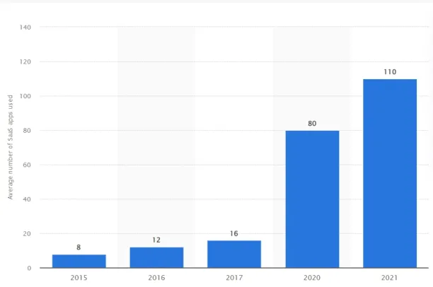

The Rise of Remote Work and the Need for Evolving Cybersecurity
===============================================================

The COVID-19 pandemic has dramatically altered how we work. With 87% of businesses adopting hybrid models, the traditional office is no longer the norm. Cloud platforms have taken the place of on-premises technologies, enabling flexible work locations. This shift, however, presents new cybersecurity challenges.

Previously, threats were primarily confined to physical devices and software within company walls. Today, securing a scattered workforce demands new approaches. This article explores how Donjun Digital can help companies minimize cyber risks in this "new normal" of remote and hybrid work.

SASE, or Secure Access Service Edge, simplifies secure access for various scenarios, including branch offices, remote workers, and on-site users. This cloud-based service combines networking and security functions like SD-WAN, SWG, CASB, NGFW, and ZTNA. It prioritizes zero-trust access, meaning access is granted only after verifying the user's device identity, real-time context, and adherence to security and compliance policies.

Figure 1: Average number of Saas tools used per organization.

.. note::

   This project is under active development.

Contents
--------

.. toctree::

   usage
   api
